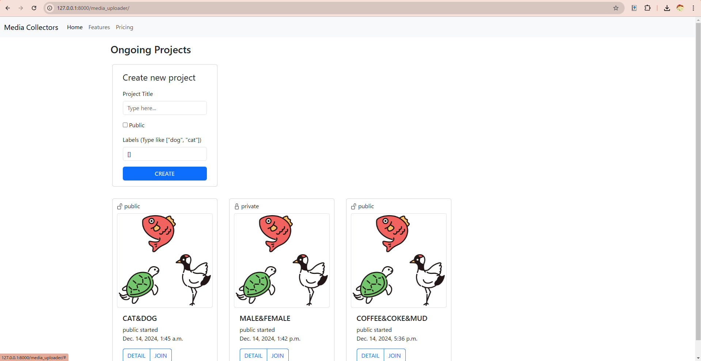
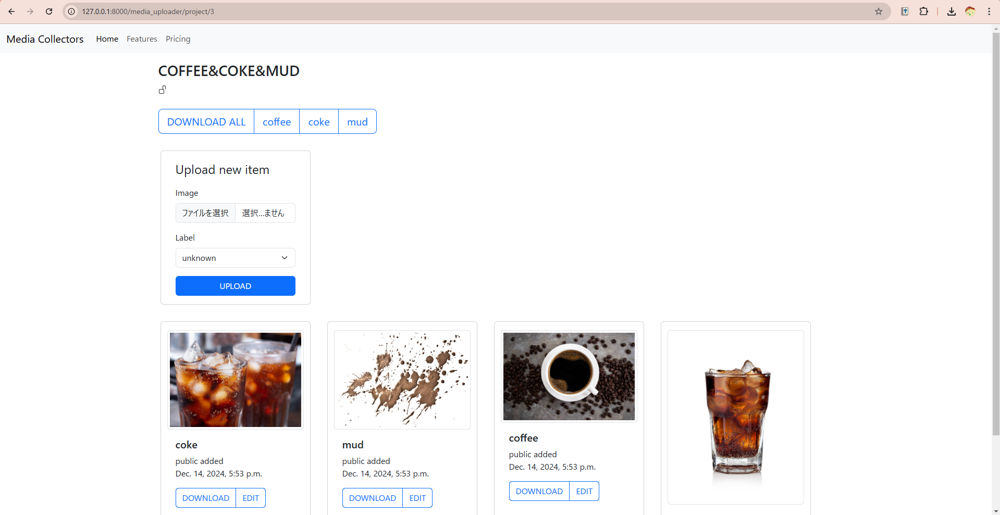

# media_collector
## 目次
1. [概要](#概要)
2. [開発環境](#開発環境)
3. [使い方](#使い方)
4. [今後の計画](#今後の計画)
5. [参考資料](#参考資料)
## 概要
ラベル付き画像を管理できるウェブアプリ。
## 使用技術一覧
### バックエンド

### 使用言語

## 開発環境
| 言語・フレームワーク | バージョン |
| ------------------  | ---------- |
| python | |
| Django | |

## 使い方
1. indexでは、プロジェクト一覧が取得できます。新規プロジェクト立ち上げも可能です。

2. projectでは、プロジェクトの詳細、登録画像一覧が確認できます。手持ちのファイルをアップロードしたり、登録された画像をラベルごとにダウンロードすることができます。

## 今後の計画
- カスタムユーザーモデル
- privateプロジェクトへの参加認証
- 同一画像チェック機構
- 複数ファイルの一括アップロード
## 参考資料
- 掌田津耶乃. Python Django3 超入門. 秀和システム. 2020
- [Bootstrapドキュメント](https://getbootstrap.jp/docs/5.3/getting-started/introduction/)
- [Djangoドキュメント](https://docs.djangoproject.com/en/5.1/)
- Narito Blog. [Djangoで、ファイルダウンロード](https://blog.narito.ninja/detail/93). 2019. Accessed 14 Dec, 2024